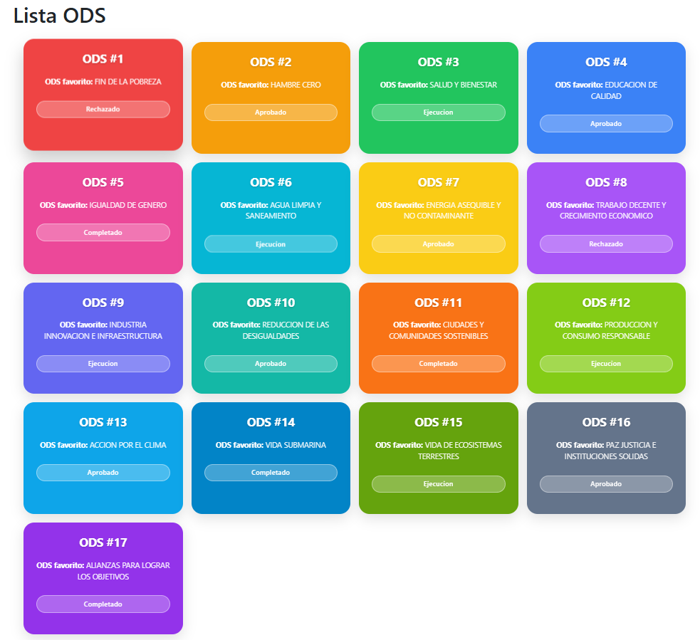

# Proyecto sostenible con React, TypeScript y boostrap

## 🌍 ODS Cards

Proyecto con **Vite + React + Node.js** que muestra los 17 Objetivos de Desarrollo Sostenible en tarjetas interactivas.

## 🚀 Tecnologías

**Vite** es la herramienta que arranca el proyecto y actualiza el navegador al instante cada vez que guardas un cambio.

**React** es la librería con la que construyes la interfaz dividiéndola en componentes reutilizables, como las Cards que muestran los 17 ODS.

**Node.js** es el entorno que necesitas tener instalado en tu ordenador para poder usar JavaScript fuera del navegador, instalar librerías y ejecutar el proyecto.

### 📸 Resultado

